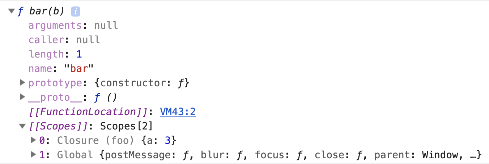
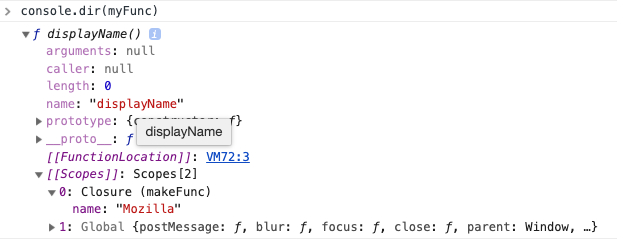
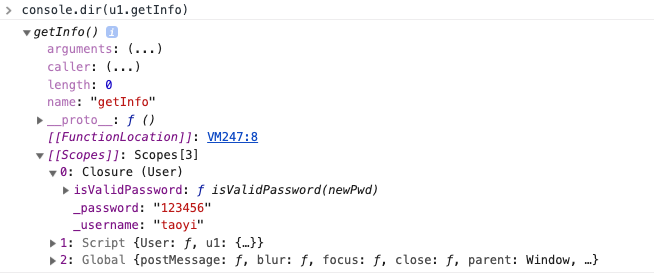
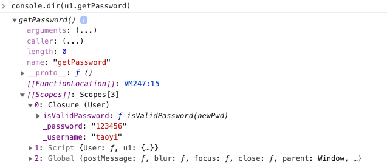

### 闭包

一句话概述：

> A closure is created when a function is returned from another function, retaining its original scope.

当一个外部函数返回一个内部函数时，内部函数会保留它所在的外部函数的作用域。

```js
function foo(a) {
  function bar(b) {
    return a + b;
  }
  return bar;
}

var add3 = foo(3);

console.log(add3(4));

// 这里我们可以说 add3 持有一个闭包作用域
// 它可以访问foo作用域中的所有变量
```



注意最后一句：**retaining its original scope**

```js
function makeFunc() {
  var name = "Mozilla";
  function displayName() {
    console.log(name);
  }
  return displayName; // 在内部函数被执行前，被外部函数返回
}

var myFunc = makeFunc();
myFunc();
```

##### 在一些编程语言中，当函数执行完毕，函数内部的局部变量将被销毁，会导致 `name` 不可访问。然而在 JavaScript 中并不是这样！

闭包是允许这段代码可以执行的原因。JavaScript 中的函数会形成闭包。闭包是由函数以及创建该函数的词法环境所组成。



```js
function makeAdder(x) {
  return function(y) {
    return x + y;
  };
}

const add5 = makeAdder(5);
const add10 = makeAdder(10);

console.log(add5(2));
console.log(add10(2));
```

`add5` 和 `add10` 都是闭包，它们共享相同的函数定义，但是保存了不同的词法环境。

### 用闭包模拟私有方法

JavaScript 中没有原生支持私有方法，但我们可以使用闭包来模拟私有方法。私有方法不仅仅有利于限制对代码的访问:还提供了管理全局命名空间的强大能力，避免非核心的方法弄乱了代码的公共接口部分。

下面展示如何使用闭包来定义公共函数，并令其可以访问私有函数和变量。这个方式也称为 **模块模式**。

```js
const User = function(username, password, balance) {
  let _username = username;
  let _password = password;
  function isValidPassword(newPwd) {
    return newPwd.match(/^[a-zA-Z0-9]{5,10}$/);
  }
  return {
    getInfo: () => `{username: ${_username}, password: ${_password}}`,
    setPassword: newPwd => {
      if (!isValidPassword(newPwd)) throw new Error("invalid password");
      _password = newPwd;
      return true;
    },
    getUserName: () => _username,
    getPassword: () => _password
  };
};

const u1 = new User("taoyi", "123456");
console.log(u1.getInfo());
console.log(u1.getUserName());
console.log(u1.getPassword());
console.log(u1.setPassword("54321"));
console.log(u1.getPassword());
```

每个闭包都有自己的词法环境，这次我们只创建了一个词法环境，为 4 个函数所共享 `getInfo`, `setPassword`, `getPassword`, `getUserName`。该共享环境创建于一个立即执行的匿名函数体内。这个环境中包含 3 个私有项：变量`_username`, `_password` 和函数 `changeBalance`




可以看出 `getInfo` , `getPassword` 等这些被返回的函数持有闭包，闭包中有对局部变量的引用。这就是用闭包模拟了私有变量。这些局部变量是无法通过 `u1` 直接访问的。

---

### 在循环中创建闭包：一个常见的错误

```html
<body>
  <button>Zero</button>
  <button>One</button>
  <button>Two</button>
  <button>Three</button>
  <script src="closure.js"></script>
</body>
```

```js
const buttons = document.getElementsByTagName("button");

for (var i = 0; i < buttons.length; i++) {
  buttons[i].addEventListener("click", () => {
    alert(i);
  });
}
```

无论哪个按钮都会 `alert(4)`，导致这个 bug 的原因是 JS 中没有局部作用域，每个事件监听器都共享同一个变量 `i`，当事件触发时，`i` 的值被确定下来，是 `4`，这 4 个闭包中的 `i` 都指向了 `4`。

#### 在 `let` 之前解决这个 bug 的方法是用`IIFE`

```js
const buttons = document.getElementsByTagName("button");

for (let i = 0; i < buttons.length; i++) {
  (function() {
    buttons[i].addEventListener("click", () => {
      alert(i);
    });
  })(); // 马上把当前循环项的元素与事件回调关联起来
}
```

### 性能考量

如果不是某些特定任务需要使用闭包，在其它函数中创建函数是不明智的，因为闭包在处理速度和内存消耗方面对脚本性能具有负面影响。

例如，在创建新的对象或者类时，方法通常应该关联于对象的原型，而不是定义到对象的构造器中。原因是这将导致每次构造器被调用时，方法都会被重新赋值一次（也就是，每个对象的创建）。

```js
function MyObject(name, message) {
  this.name = name.toString();
  this.message = message.toString();
  this.getName = function() {
    return this.name;
  };

  this.getMessage = function() {
    return this.message;
  };
}
```

在上面的代码中，我们并没有利用到闭包的好处，因此可以避免使用闭包。修改成如下：

```js
function MyObject(name, message) {
  this.name = name.toString();
  this.message = message.toString();
}
MyObject.prototype.getName = function() {
  return this.name;
};
MyObject.prototype.getMessage = function() {
  return this.message;
};
```
