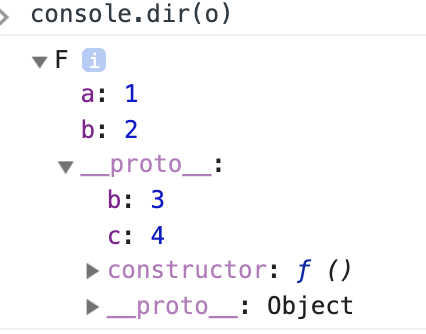

### 基于原型的语言

JS 中 _每个对象拥有一个原型对象_ `__proto__`，对象以其原型为模板、从原型继承方法和属性。

_原型对象也可能拥有原型_，并从中继承方法和属性，一层一层、以此类推。这种关系常被称为原型链 (prototype chain)，它解释了为何一个对象会拥有定义在其他对象中的属性和方法。

> 注意: 理解对象的原型（可以通过 `Object.getPrototypeOf(obj)` 或者已被弃用的**proto**属性获得）与构造函数的 `prototype` 属性之间的区别是很重要的。前者是每个实例上都有的属性，后者是构造函数的属性。也就是说，Object.getPrototypeOf(new Foobar())和 Foobar.prototype 指向着同一个对象。

### 函数拥有 `prototype` 属性

在 JS 中，函数可以有属性。 每个函数都有一个特殊的属性叫作原型 `prototype`。

- 由于函数也是对象，所以函数既有 `prototype` 属性对象，也有 `__proto__` 原型对象。
- 对象只有 `__proto__` 对象。

创建对象的步骤：

1. 用构造函数的 `prototype` 属性（原型对象）作为模板创建一个对象实例
2. 将对象实例的 `__proto__` 属性指向它的原型对象（也就是构造函数的 `prototype` 所指向的对象）

```js
function Person() {}
const p1 = new Person();
Object.getPrototypeOf(p1) === Person.prototype;
```

#### 注意点 1：对象的 `__proto__` 属性指向原型对象，它的构造函数的 `prototype` 属性也指向原型对象。构造函数自己的 `__proto__` 属性指向用来创建这个构造函数对象的原型对象。

#### 注意点 2：`__proto__` 原型对象拥有 `constructor` 属性指向它的构造函数。

```js
Person.prototype.constructor === Person; // true
p1.__proto__.constructor === Person; // true
```

#### 注意点 3: 原型链搜索是利用 `__proto__` 属性进行搜索的过程，而不是 `prototype`。

当你访问一个对象 `obj` 的属性时，浏览器首先会查找 `obj` 是否有这个属性，如果 `obj` 没有这个属性，那么会去它的 `__proto__` 上查找这个属性，

#### 注意点 4：所有（构造）函数的原型对象的 `__proto__` 属性指向的是 `window.Object.prototype` 所指向的原型对象。


当调用 `person1` 中实际定义在 `Object` 上的方法时会发生什么？

```js
person1.value();
```

这个方法仅仅返回了被调用对象的值。

1. 浏览器首先检查，`person1` 对象是否具有 `valueOf` 这个方法。
2. 如果没有，则检查 `person1` 的原型对象 （`__proto__` 指向的对象）
3. 如果也没有，则检查原型对象的 `__proto__` 属性所指向的原型对象，也就是 `Object.prototype`，在这里找到了，就调用这个方法。

#### 注意点 5：在`prototype` 属性所指向的对象上定义需要被继承的成员变量/函数

#### 注意点 6: 可以通过 `instanceName.constructor.name` 得到构造函数的名字

---

### 原型链和继承

当谈到继承时，JavaScript 只有一种结构：对象。每个实例对象（ object ）都有一个私有属性（称之为 **proto** ）指向它的原型对象（ `prototype` ）。该原型对象也有一个自己的原型对象( **proto** ) ，层层向上直到一个对象的原型对象为 null。根据定义，null 没有原型，并作为这个原型链中的最后一个环节。

```js
let F = function() {
  this.a = 1;
  this.b = 2;
};

let o = new F();
console.log(o);

// 在f函数的原型上定义属性
F.prototype.b = 3;
F.prototype.c = 4;
```



##### 普通对象继承

```js
// o 这个对象继承了 Object.prototype 上面的所有属性
var o = { a: 1 };

// o 自身没有名为 hasOwnProperty 的属性
// hasOwnProperty 是 Object.prototype 的属性
// 因此 o 继承了 Object.prototype 的 hasOwnProperty
// Object.prototype 的原型为 null
// 原型链如下:
// o ---> Object.prototype ---> null
```

##### 数组继承

```js
var a = ["yo", "whadup", "?"];

// 数组都继承于 Array.prototype
// (Array.prototype 中包含 indexOf, forEach 等方法)
// 原型链如下:
// a ---> Array.prototype ---> Object.prototype ---> null
```

##### 函数继承

```js
// 函数都继承于 Function.prototype
function f() {
  return 2;
}

// (Function.prototype 中包含 call, bind等方法)
// 原型链如下:
// f ---> Function.prototype ---> Object.prototype ---> null
```

### 继承完整案例

```js
// 父类A
function A(a) {
  this.varA = a;
}

// 子类B继承于父类A
function B(a, b) {
  A.call(this, a);
  this.varB = b;
}

// 修改B的原型，让其能够继承A的原型中的所有成员
B.prototype = Object.create(A.prototype, {
  varB: {
    value: null,
    enumerable: true,
    configurable: true,
    writable: true
  },
  doSomething: {
    value: function() {
      // override
      A.prototype.doSomething.apply(this, arguments);
      // call super
      // ...
    },
    enumerable: true,
    configurable: true,
    writable: true
  }
});

// 别忘了修改B的原型的构造函数的指向，从A改为B
B.prototype.constructor = B;

var b = new B();
b.doSomething();
```
